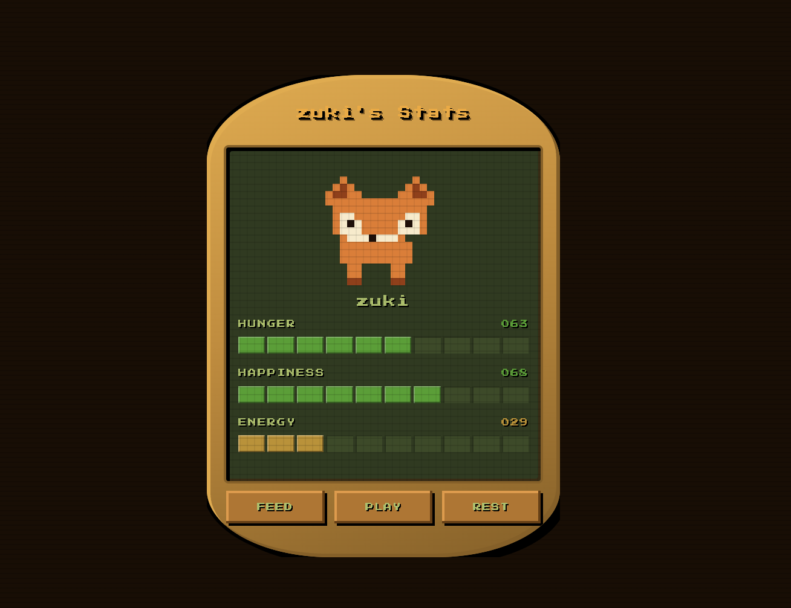

# Zuki Pet

A Tamagotchi-style virtual pet built with React 19, TypeScript, and pixel art aesthetics.



---

## What is Zuki?

Zuki is a pixel art fox who needs your attention. Feed her, play with her, and let her rest — or she'll let you know exactly how she feels about it.

The app runs entirely in the browser with no backend. State persists across sessions via `localStorage`.

---

## Features

- **Naming flow** — first launch prompts you to name your fox
- **Living vitals** — Hunger, Happiness, and Energy decay every 15 seconds
- **Care loop** — Feed, Play, and Rest actions affect stats with clamped math
- **Dynamic states** — Zuki can become sick (stats too low) or evolve (all stats high + enough care actions)
- **Personality & Easter eggs** — six context-sensitive messages triggered by specific conditions (overfed, exhausted play, forced rest, spam click, idle guilt, peak happiness)

---

## Tech Stack

| Layer | Tool |
|---|---|
| Framework | React 19 + TypeScript |
| Styling | Tailwind CSS v4 + CSS custom properties |
| Build | Vite 8 |
| Tests | Vitest + React Testing Library |
| Font | Press Start 2P (Google Fonts) |

---

## Getting Started

```bash
npm install
npm run dev
```

Open [http://localhost:5173](http://localhost:5173).

---

## Running Tests

```bash
npx vitest run
```

68 tests across 7 suites covering state logic, component rendering, timing behavior, and persistence.

```bash
npm run build
```

Verifies TypeScript compiles with no errors.

---

## Project Structure

```
src/
  components/
    ActionPanel.tsx      # FEED / PLAY / REST buttons
    MessageBubble.tsx    # Easter egg message overlay
    NamingModal.tsx      # First-launch naming screen
    PetDisplay.tsx       # Pixel fox + status labels
    PixelFox.tsx         # SVG pixel art fox (normal / sick / evolved)
    VitalsPanel.tsx      # Segmented stat bars
  hooks/
    useGameState.ts      # All game logic and state machine
  utils/
    storage.ts           # localStorage helpers
specs/
  features/              # Spec-Driven Development docs per feature
```

---

## Specs

Each feature has a dedicated spec in `specs/features/` covering implementation details, automated test requirements, manual smoke tests, and acceptance criteria. The specs are the primary design artifact — code follows them.
